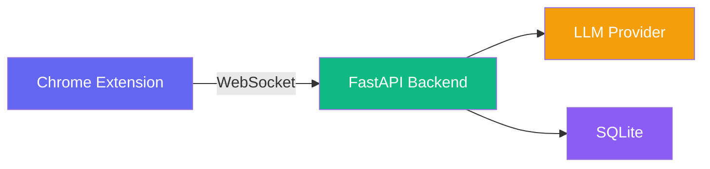

# Snag

AI-powered job application copilot. Bring your own API key — supports Ollama (local/free), OpenAI, Anthropic, Groq, or any OpenAI-compatible provider.

---

## Architecture



**Chrome Extension** — Detects form fields, injects sidebar, calls the LLM directly (BYOK), fills answers, imports a resume into your profile
**FastAPI Backend** — Classifies fields, builds the prompt/context, stores memory. Binds to `127.0.0.1` only and requires a per-installation auth token on every request (see Security below) — it never calls an LLM or sees your API key itself
**LLM Provider** — Ollama (local), OpenAI, Anthropic, Groq, or OpenAI-compatible — called from the extension, not the backend
**SQLite** — Profile data, session history, saved answers with embeddings — local, unencrypted (see Security)

---

## How It Works


1. **Page Loads** — Content script scans the DOM for form fields
2. **Extract Fields** — Labels, placeholders, types, and context are captured
3. **Classify** — Backend categorizes each field (name, email, question, etc.)
4. **User Clicks Question** — Click any open-ended question in the sidebar
5. **Generate Answer** — LLM generates a tailored draft using your profile + past answers
6. **Review** — Accept, Edit (then accept), Regenerate, or Skip
7. **Fill & Confirm** — Accepting asks the content script to fill the field, then waits for it to confirm the DOM write actually succeeded before showing "Filled & Saved" — a stale selector or a field the page removed shows **Couldn't fill this field** with Retry/Edit/Skip/Fill-manually instead of a false success
8. **Learn** — Only once that fill is confirmed is the final answer stored as memory, so a similar question on a future application — even for a different company — can be recognized and adapted

Regenerating or skipping never touches memory. Re-accepting the same question updates its existing memory entry instead of creating a duplicate. Sensitive profile fields (work authorization, visa status, gender, date of birth) are never auto-filled even when Snag has a confident value for them — they're surfaced as a reviewable suggestion through the same Accept/Edit/Skip flow.

---

## Project Structure

```
Snag/
├── backend/
│   ├── app.py                  # FastAPI entry point
│   ├── config.py               # Pydantic settings
│   ├── answer_service.py       # Builds the prompt/context sent to the extension's LLM call
│   ├── auth.py                 # Per-installation token check (REST + WebSocket)
│   ├── resume_parser.py        # Extracts raw text from an uploaded .pdf/.txt resume
│   ├── resume_service.py       # Builds the resume -> profile-fields extraction prompt
│   ├── memory/
│   │   ├── sqlite_store.py     # SQLite DB wrapper
│   │   ├── memory_service.py   # Semantic search (numpy)
│   │   └── embeddings.py       # sentence-transformers
│   ├── api/
│   │   ├── ws.py               # WebSocket handler
│   │   ├── answer_routes.py    # POST /api/answer/generate
│   │   ├── profile_routes.py   # Profile CRUD
│   │   └── memory_routes.py    # Memory retrieval
│   ├── prompts/                # Question-type templates
│   ├── tests/                  # pytest suite for the learning loop
│   └── requirements.txt
│
├── extension/
│   ├── manifest.json           # Manifest V3
│   ├── settings/               # Options page (API config)
│   ├── src/
│   │   ├── background/         # Service worker (health ping + WS)
│   │   ├── content/            # Content script
│   │   └── shared/             # Config utility
│   └── icons/                  # 16/48/128px SVG
│
├── ui/
│   ├── src/
│   │   ├── components/
│   │   │   ├── Sidebar.tsx     # Main layout
│   │   │   ├── StatusBadge.tsx # Live/Reconnecting/Offline
│   │   │   ├── ProfileSettings.tsx
│   │   │   ├── FeedbackModal.tsx
│   │   │   ├── AnswerCards.tsx  # Accept/Edit/Regenerate/Skip + fill-confirmation states
│   │   │   ├── MemoryManager.tsx # View/edit/delete learned answers
│   │   │   ├── ResumeImport.tsx # Upload a resume, review extracted fields, apply
│   │   │   └── ...
│   │   └── hooks/
│   │       ├── useWebSocket.ts
│   │       ├── useProfile.ts
│   │       └── useProvider.ts
│   └── vite.config.ts
│
├── logs/                       # Runtime logs (created automatically)
├── Dockerfile
├── docker-compose.yml
├── start.py                    # Build + preflight + launch script
├── setup_service.ps1           # Install SnagBackend as a Windows service (NSSM)
└── SPECS.md
```

---

## Getting Started

### Prerequisites

- Python 3.12+
- Node.js 20+
- Ollama (optional — only if using local models)

### Quick Start (Local)

```bash
# 1. Install Python dependencies
pip install -r backend/requirements.txt

# 2. Install UI dependencies
cd ui && npm install && cd ..

# 3. Install extension dependencies
cd extension && npm install && cd ..

# 4. Build and run everything
python start.py
```

This will:
1. Build the React UI (`ui/build/`)
2. Copy it into the extension (`extension/sidebar/`)
3. Compile extension TypeScript
4. Run preflight checks (port availability, Ollama reachability)
5. Start the backend on `http://127.0.0.1:8765`

> [!TIP]
> Backend logs are written to `logs/snag.log` (rotating, 5MB × 5 backups).
> Warnings and errors also print to the console. SQLite runs in WAL mode
> with a 5s busy timeout so concurrent readers don't hit "database is locked".

### Run as a Windows Service (optional)

For always-on use, install the backend as a Windows service with [NSSM](https://nssm.cc/):

```powershell
# From an elevated (Administrator) PowerShell
.\setup_service.ps1              # install + start SnagBackend
.\setup_service.ps1 -Uninstall   # remove the service
```

The script auto-installs NSSM via winget if it's missing (or pass `-ForceInstallNssm`).
The service runs `python -m backend.app`, auto-starts on boot, restarts on
failure (5s delay), and writes to `logs/service_stdout.log` / `logs/service_stderr.log`.

### Load Extension in Chrome

1. Open `chrome://extensions`
2. Enable "Developer mode"
3. Click "Load unpacked" → select the `extension/` folder
4. Click the Snag icon on any page to toggle the sidebar

### Configure Your LLM Provider & Pair with the Backend

1. Right-click the Snag icon → "Options"
2. **Backend Auth Token (required)** — the backend refuses every request without
   this. The first time it starts, it prints a token to `logs/snag.log` and the
   console:
   ```
   Snag auth token (paste into the extension's Settings page):
     <your-token>
   ```
   It's also saved to `data/auth_token.txt`. Paste it into the "Backend Auth Token"
   field and Save — you only need to do this once per install.
3. Select your provider:
   - **Ollama** (local, free) — requires Ollama running with a model pulled
   - **OpenAI** — requires API key from platform.openai.com
   - **Anthropic** — requires API key from console.anthropic.com
   - **Groq** — free tier, get key from console.groq.com
   - **OpenAI-Compatible** — works with LM Studio, Together AI, etc.

### Docker

```bash
docker compose up --build
```

Backend runs on `http://localhost:8765`. Load the extension separately.

---

## API Endpoints

All endpoints except `/health` and `/api/health` require `Authorization: Bearer <token>`
(REST) or `?token=<token>` (WebSocket) — see Security below. The backend never calls
an LLM itself; `/api/answer/prepare` returns the assembled prompt/context for the
**extension** to send to whichever provider the user configured (BYOK, from the
browser, with the user's own key — the backend never sees it).

| Method | Endpoint | Description |
|---|---|---|
| `GET` | `/health` | Health check (no auth — used by the extension's health-ping) |
| `GET` | `/api/profile` | Get profile fields |
| `PUT` | `/api/profile/{key}` | Update a profile field |
| `POST` | `/api/profile/resume/upload` | Upload a resume (stored under a generated filename, never the client's); returns extracted raw text |
| `POST` | `/api/answer/prepare` | Build the prompt/context for a question (used by the WS flow; also available over REST) |
| `WS` | `resume:extract` → `resume:context` | Build the prompt/context for extracting profile fields from resume text (extension calls the LLM with it, same as answer generation) |
| `GET` | `/api/memory/answers` | List the 50 most recent approved answers |
| `PUT` | `/api/memory/answers/{id}` | Edit a learned answer's text |
| `DELETE` | `/api/memory/answers/{id}` | Delete a learned answer |
| `GET` | `/api/memory/similar` | Semantic search over approved answers |
| `WS` | `/ws/{session_id}` | Real-time field classification / answer generation / fill confirmation |

---

## Resume Import

Instead of typing every profile field by hand, upload a resume (Profile section →
"Import from resume"):

1. The file (`.pdf` or `.txt`/`.md`) is uploaded to the backend, which extracts its
   raw text (`backend/resume_parser.py`) — no LLM call yet.
2. The extension sends that text to your configured LLM provider (BYOK, same as
   answer generation) asking it to pull out first/last name, email, phone,
   city/state/country, LinkedIn/GitHub/portfolio, education, experience, and skills
   as JSON.
3. Every extracted field is shown for review — checked/unchecked, editable — before
   anything is saved. Nothing is written to your profile until you click "Apply
   Selected". Fields the resume didn't mention are left blank and unchecked.

Not extracted from a resume (not something a resume reliably states, or sensitive):
gender, date of birth, work authorization, visa status, willing-to-relocate — those
stay manually entered. Scanned/image-only PDFs won't extract text (no OCR); a plain
text export of the resume works if that happens.

---

## Profile Fields

| Field | Required | Field | Required |
|---|---|---|---|
| First Name | Yes | City | No |
| Last Name | Yes | State | No |
| Email | Yes | Zip Code | No |
| Phone | No | Country | No |
| Gender | No | Work Authorization | No |
| Date of Birth | No | Visa Status | No |
| LinkedIn | No | Willing to Relocate | No |
| GitHub | No | Education | No |
| Portfolio | No | Experience | No |
| Skills | No | | |

---

## LLM Providers

| Provider | Default Model | Free Tier |
|---|---|---|
| Ollama | qwen3:8b | Yes (local) |
| OpenAI | gpt-4o-mini | No |
| Anthropic | claude-3-5-haiku | No |
| Groq | llama-3.1-70b-versatile | Yes |
| OpenAI-Compatible | configurable | Varies |

---

## Security

Snag has no user accounts, so it relies on two boundaries instead:

- **Backend binds to `127.0.0.1` only** (`backend/config.py`) — never reachable from
  the LAN or internet, only from processes on this machine.
- **Per-installation auth token** (`backend/auth.py`) — loopback binding alone doesn't
  stop *another page* open in the same browser from calling the backend (the browser
  itself lives on that loopback interface), so every REST/WebSocket request must carry
  a random token generated on first run and persisted to `data/auth_token.txt`. You
  paste it into the extension's Settings page once; it's then read by the
  service-worker/background context only (never by page-level content scripts or the
  pages you visit) and sent as `Authorization: Bearer <token>` / `?token=`. CORS is
  left permissive — it is **not** the access-control mechanism here, the token is.
- **Resume uploads** are stored under a generated filename inside `data/resumes/`; the
  client-supplied filename is never used to build the on-disk path (only its
  extension is kept, sanitized), so a crafted filename can't write outside that
  directory.
- **Sensitive profile fields** (work authorization, visa status, gender, date of
  birth) are never auto-filled — they go through the same reviewable Accept/Edit/Skip
  flow as a generated answer, even though Snag has a directly usable profile value.
- **Not implemented: encryption at rest.** `data/snag.db` (profile, resume paths,
  approved-answer history) and `data/auth_token.txt` are plain, unencrypted files.
  Anyone with filesystem access to this machine/account can read them. If that's not
  an acceptable risk for your machine, don't run Snag there yet.
- **API keys** (BYOK) and the auth token live in `chrome.storage.local` (not `.sync`
  — nothing here is synced to your Google account or another device). They're read
  only by the extension's own background/options/sidebar contexts, never by page
  content scripts or the pages you visit.

---

## Reliability

Built to run unattended as a persistent local tool:

- **SQLite WAL mode** — concurrent readers + one writer with a 5s busy timeout (no "database is locked")
- **LLM calls have a timeout and a single retry** — the extension calls the LLM
  provider directly (not the backend), each call is capped at 45s
  (`extension/src/llm/constants.ts`) via `AbortSignal.timeout`, and a transient
  network/timeout failure gets exactly one retry with a 1s backoff — never an
  unbounded retry loop. A generation that somehow still doesn't resolve within 100s
  (e.g. the WebSocket itself is down) is surfaced as a UI error instead of spinning
  forever.
- **Startup preflight** — `start.py` verifies the port is free and warns (non-fatal) if Ollama is unreachable before launching
- **WebSocket reconnect** — the sidebar backs off exponentially (1s → 30s cap) and shows `Live` / `Reconnecting` / `Offline`
- **Extension health ping** — the service worker pings `/health` every 30s and broadcasts `backend:status` to the sidebar
- **Windows service** — `setup_service.ps1` registers the backend under NSSM with auto-start and restart-on-failure
- **Fill confirmation** — accepting an answer doesn't report/save success until the
  content script confirms the DOM write actually happened; a stale selector or a
  field the page removed surfaces as a clear failure with Retry/Edit/Skip/Fill-manually,
  never a false "Filled & Saved".

---

## Memory & Retrieval

Approved answers are matched by semantic similarity (sentence-transformers embeddings,
cosine similarity) rather than exact text match, so paraphrased questions ("why do you
want to join this company" vs. "why are you interested in working here") retrieve the
same memory. Retrieval is **not** restricted to the current company/role — a same
company/role match ranks slightly higher, but a strong semantic match from a different
company still surfaces, and the answer-generation prompt explicitly instructs the model
to adapt (not copy) an answer written for a different company/role. Re-accepting the
same question for the same company/role updates that memory in place instead of
creating a duplicate row.

## Testing

```bash
# Backend test suite (profile CRUD, classification, semantic retrieval,
# cross-company adaptation, dedup, prompt construction, error handling)
python -m pip install -r backend/requirements.txt
python -m pytest -q
```

Tests run against an isolated temp SQLite file and a fast deterministic stand-in for
the embedding model — no model download or GPU needed to run them.

```bash
# Extension unit tests (vitest) — the pure, chrome-independent logic
cd extension && npm install && npm test
```

## Development

```bash
# TypeScript check (UI)
cd ui && npx tsc --noEmit

# TypeScript check (Extension)
cd extension && npx tsc --noEmit

# Backend import check
python -c "from backend.app import app; print('OK')"

# Backend tests
python -m pytest -q

# Extension tests
cd extension && npm test

# Build UI only
cd ui && npm run build

# Build extension only
cd extension && npm run build
```

---

## Known Limitations

- No encryption at rest for the local database, resume files, or the auth token file
  — see Security above. Anyone with access to this machine/OS account can read them.
- Form filling handles `<input>`/`<textarea>`/contenteditable, `<select>` dropdowns
  (matched by option value or visible text), and individual checkbox/radio inputs
  (matched against yes/no-style values or the option's own label). A **radio/checkbox
  group** (e.g. a multi-choice question rendered as several radio inputs) is still
  extracted as separate individual fields rather than one grouped question — Snag can
  fill a specific option once it knows which one, but doesn't yet reason about
  "which of these N options answers this question" as a single decision.
- The exact-label fallback match (used only when a field's own selector goes stale)
  requires the label to be unique on the page; an ambiguous or missing match is
  reported as a failure rather than guessed — by design, but it does mean a page with
  several genuinely identically-labeled fields needs its selectors to stay valid.
- Job context passed to answer generation includes a best-effort job description
  scrape (common ATS containers, falling back to the page's meta description),
  truncated to a few thousand characters. Sites with unusual layouts may still yield
  no description — generation degrades gracefully to title/company only.
- The memory management screen is intentionally minimal — list/edit/delete, no
  search, tagging, or bulk actions.
- Resume import supports `.pdf`/`.txt`/`.md` only (no `.docx`), has no OCR for
  scanned/image PDFs, and needs an LLM provider configured (it's a BYOK LLM call,
  same as answer generation) — a resume upload with no provider configured will
  extract the raw text fine but fail at the field-extraction step.
- Extension unit tests (vitest) cover the pure logic in `shared/config.ts` and
  `llm/client.ts`, plus the DOM logic in `content/index.ts` (stable field ids, exact-
  match-only field lookup, select/checkbox filling) via a test-only escape hatch —
  see the `__SNAG_TEST__` block at the bottom of that file. It's still not a full
  end-to-end browser test; the sidebar's React components and the WS message
  contract between background/content/backend are exercised by the backend's WS
  tests (`backend/tests/test_fill_flow.py`) and manual testing, not automated.

---

## License

MIT
