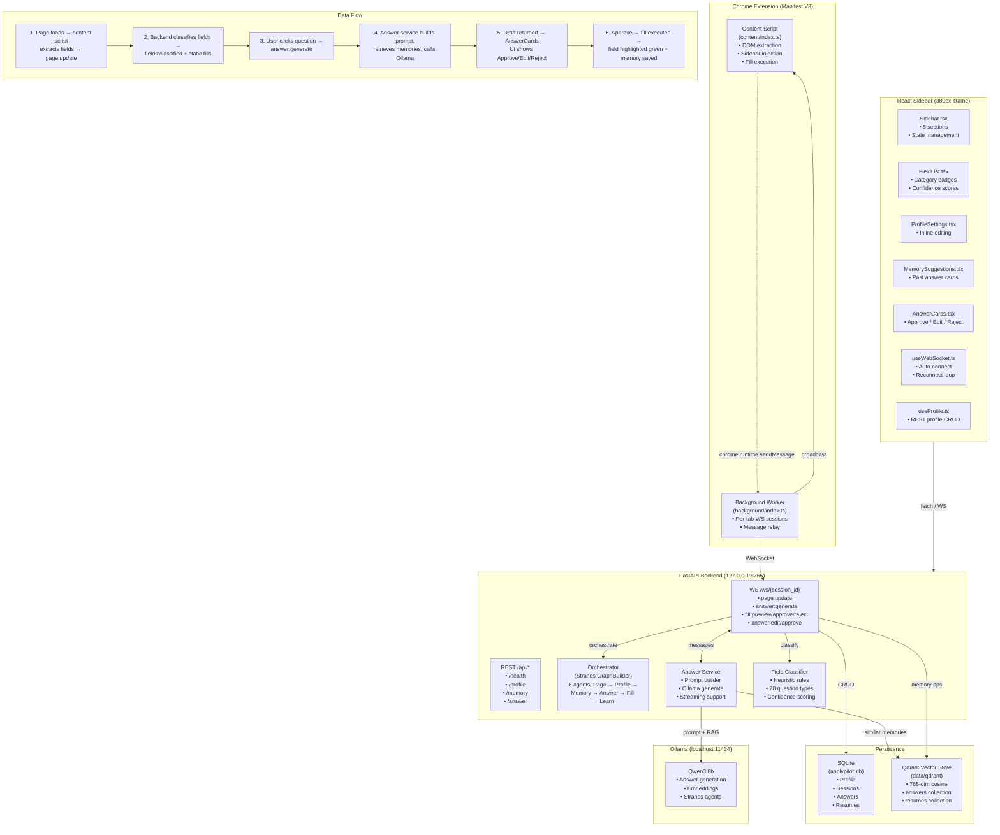
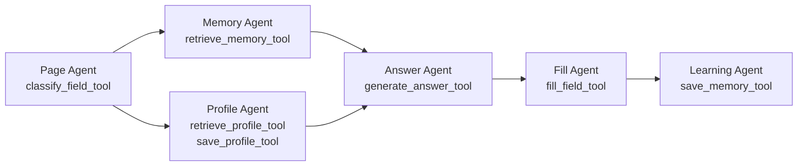

# ApplyPilot

A local-first, AI-powered job application copilot. Detects form fields on any job board, autofills static profile data, generates tailored answers via Ollama, and learns from user edits over time.

---

## Architecture



---

## Project Structure

```
job-apply-agent/
├── backend/                          # FastAPI Python backend
│   ├── app.py                        # Entry point, startup/shutdown
│   ├── config.py                     # Pydantic settings (env-based)
│   ├── orchestrator.py               # Strands multi-agent graph builder
│   ├── session.py                    # Session + field management
│   ├── answer_service.py             # Ollama answer generation + streaming
│   ├── agents/
│   │   ├── base.py                   # 6 agent factory functions
│   │   └── __init__.py               # Re-exports
│   ├── api/                          # REST + WebSocket routes
│   │   ├── ws.py                     # WS endpoint + ConnectionManager
│   │   ├── routes.py                 # GET /api/health
│   │   ├── profile_routes.py         # Profile CRUD (7 routes)
│   │   ├── memory_routes.py          # Memory retrieval (2 routes)
│   │   └── answer_routes.py          # Answer generation (2 routes)
│   ├── memory/
│   │   ├── embeddings.py             # Ollama embedding client
│   │   ├── qdrant_store.py           # Qdrant vector DB wrapper
│   │   ├── sqlite_store.py           # SQLite relational DB wrapper
│   │   └── memory_service.py         # High-level save/find ops
│   ├── prompts/
│   │   └── templates.py              # 9 question-type prompt templates
│   ├── tools/
│   │   └── tools.py                  # 8 Strands @tool functions
│   └── requirements.txt
│
├── extension/                        # Chrome Extension (Manifest V3)
│   ├── manifest.json
│   ├── src/
│   │   ├── background/
│   │   │   └── index.ts              # Per-tab WS session management
│   │   └── content/
│   │       ├── index.ts              # DOM extraction, sidebar injection, fill
│   │       └── styles.css            # Sidebar styles
│   └── icons/                        # SVG icons (16, 48, 128)
│
├── ui/                               # React sidebar (Vite + Tailwind)
│   ├── src/
│   │   ├── main.tsx                  # React mount
│   │   ├── App.tsx                   # Root component
│   │   ├── index.css                 # Tailwind base + global styles
│   │   ├── components/
│   │   │   ├── Sidebar.tsx           # Main layout, state orchestration
│   │   │   ├── Section.tsx           # Reusable glassmorphism card
│   │   │   ├── StatusBadge.tsx       # Live/Offline pulsing indicator
│   │   │   ├── ProfileSettings.tsx   # Inline profile editor
│   │   │   ├── FieldList.tsx         # Classified field list with badges
│   │   │   ├── MemorySuggestions.tsx # Past answer suggestion cards
│   │   │   └── AnswerCards.tsx       # Draft answer approve/edit/reject UI
│   │   └── hooks/
│   │       ├── useWebSocket.ts       # WS lifecycle hook
│   │       └── useProfile.ts         # Profile REST hook
│   ├── index.html
│   ├── vite.config.ts
│   ├── tailwind.config.js
│   └── package.json
│
├── shared/
│   └── types.py                      # Shared Python dataclasses
├── data/
│   └── qdrant/                       # Qdrant persistent storage
├── SPECS.md                          # High-level system spec (7 phases)
└── README.md                         # This file
```

---

## Components

### Backend (FastAPI)

| Module | Purpose | Key Files |
|---|---|---|
| API Server | FastAPI entry point, CORS, router inclusion, startup/shutdown lifecycle | `app.py`, `config.py` |
| WebSocket | Real-time bidirectional communication with extension; handles 10 message types | `api/ws.py` |
| REST API | Health check, profile CRUD, memory retrieval, answer generation | `api/routes.py`, `api/profile_routes.py`, `api/memory_routes.py`, `api/answer_routes.py` |
| Orchestrator | Strands `GraphBuilder` with 6 agents in a directed pipeline (Page → Profile → Memory → Answer → Fill → Learn) | `orchestrator.py` |
| Agents | 6 agent factory functions with role-specific system prompts and tool bindings | `agents/base.py` |
| Tools | 8 `@tool`-decorated functions: classify, retrieve/save profile, retrieve/save memory, generate answer, fill field, detect job site | `tools/tools.py` |
| Field Classifier | Heuristic rule engine: static map (10 key types), file/select/checkbox/long-answer detection, 20 question-type regex patterns, confidence scoring (0.35–0.95) | `tools/tools.py:classify_field_heuristic` |
| Answer Service | Prompt builder using 9 question-type templates, Ollama generate (streaming + non-streaming), RAG with profile + memory | `answer_service.py` |
| Prompt Templates | 9 templates: introduction, motivation, behavioral (STAR), technical, salary, strengths/weaknesses, cover letter, general; `ANSWER_SYSTEM` ruleset | `prompts/templates.py` |
| Memory | Qdrant vector store (768-dim, cosine), Ollama embeddings, SQLite relational store (profile, sessions, answers, resumes) | `memory/*.py` |

#### REST API Reference

| Method | Endpoint | Description |
|---|---|---|
| `GET` | `/api/health` | Server status, Ollama model info |
| `GET` | `/api/profile` | Get all verified profile fields |
| `GET` | `/api/profile/all` | Get all profile fields with metadata |
| `PUT` | `/api/profile/{key}` | Update a profile field |
| `DELETE` | `/api/profile/{key}` | Delete a profile field |
| `POST` | `/api/profile/resume/upload` | Upload a resume file |
| `GET` | `/api/profile/resumes` | List uploaded resumes |
| `DELETE` | `/api/profile/resume/{id}` | Delete a resume |
| `GET` | `/api/memory/answers` | Last 50 saved answers |
| `GET` | `/api/memory/similar` | Semantic search for similar answers |
| `POST` | `/api/answer/generate` | Generate an answer (non-streaming) |
| `POST` | `/api/answer/generate/stream` | Generate an answer (NDJSON stream) |

#### WebSocket Messages (`/ws/{session_id}`)

| Direction | Type | Payload | Description |
|---|---|---|---|
| → Backend | `page:update` | `{ fields, url, jobTitle, company }` | Send detected form fields |
| → Backend | `answer:generate` | `{ question, fieldId }` | Request AI answer generation |
| → Backend | `fill:preview` | `{ fieldId, selector, value }` | Preview fill on field |
| → Backend | `fill:approve` | `{ fieldId, selector, value, question }` | Approve and execute fill |
| → Backend | `fill:reject` | `{ fieldId }` | Reject fill |
| → Backend | `fill:execute` | `{ selector, value }` | Direct field fill |
| → Backend | `answer:edit` | `{ question, edited, original }` | Save edited answer |
| → Backend | `answer:approve` | `{ question, answer }` | Save approved answer |
| ← Client | `status:update` | `{ connected, sessionId, fieldCount, ... }` | Connection status |
| ← Client | `fields:classified` | `{ classifications[] }` | Field classification results |
| ← Client | `profile:fills` | `{ fills[] }` | Static autofill values |
| ← Client | `memory:suggestions` | `{ suggestions[] }` | Past answer suggestions |
| ← Client | `answer:draft` | `{ draft, questionType, confidence, ... }` | Generated answer draft |
| ← Client | `fill:preview` | `{ fieldId, selector, label, value }` | Fill preview highlight |
| ← Client | `fill:executed` | `{ fieldId, selector, value, success }` | Fill execution result |
| ← Client | `fill:rejected` | `{ fieldId }` | Fill rejected |
| ← Client | `answer:saved` | `{ question }` | Answer saved confirmation |

### Chrome Extension (Manifest V3)

| Script | Purpose |
|---|---|
| `background/index.ts` | Per-tab WebSocket session management; creates WS per tab, relays `page:update` to backend, forwards backend messages to content script |
| `content/index.ts` | DOM extraction (`extractFormFields`), CSS selector generation (`buildSelector`), sidebar iframe injection (`injectSidebar`), field fill with highlight animation (`applyFill`), job page detection (`isOnJobPage`) |

**Sidebar injection:** A 380px fixed iframe loaded from `sidebar/index.html` is injected on job pages. A toggle button ("AP") slides it in/out.

**Field detection:** Queries `input, textarea, select, [role=textbox], [contenteditable=true]`, extracts label via `for`/parent/nearby heuristics, context from parent fieldset/section headings, builds unique CSS selectors via parent-path traversal.

### UI (React + TailwindCSS)

| Component | Purpose |
|---|---|
| `Sidebar` | Main layout, 8 sections, manages `draftMap` state, handles `answer:draft` WS messages |
| `Section` | Reusable glassmorphism card wrapper with icon |
| `StatusBadge` | Animated pulsing green/amber connection indicator |
| `ProfileSettings` | Inline-editable profile fields (10 fields, 2 required) |
| `FieldList` | Color-coded field categories with confidence dot (green/amber/red) |
| `MemorySuggestions` | Past answer cards with match scores and company/role context |
| `AnswerCards` | Generated answer drafts with Approve & Fill / Edit / Reject buttons + textarea editing |

---

## Data Flow

### 1. Form Detection & Static Autofill

```
Browser page loads
    → content script: extractFormFields() (labels, selectors, context)
    → chrome.runtime.sendMessage("page:update")
    → background: createSession(tab) → WebSocket connect
    → backend WS handler:
        1. classify_fields() → heuristic classification
        2. match_static_fields() → profile-based fill values
        3. Send "fields:classified" + "profile:fills" + "status:update"
        4. For long_answer fields → find_similar_for_fields() → "memory:suggestions"
    → extension: applyFill() for static matches
    → UI: FieldList + MemorySuggestions update
```

### 2. Answer Generation & Fill

```
User clicks a long_answer button in UI
    → send("answer:generate", { question })
    → backend WS handler → generate_answer():
        1. sqlite_store.get_profile()
        2. find_similar(question) → Qdrant semantic search
        3. build_prompt(question, profile, memories, ...)
        4. Ollama /api/generate → draft answer
        5. Return { draft, questionType, confidence, ... }
    → "answer:draft" WS message → UI AnswerCards renders

User clicks "Approve & Fill"
    → send("fill:preview") → extension highlightField(yellow)
    → send("fill:approve") → extension applyFill(green highlight)
        → backend: save_answer() → Qdrant + SQLite
    → send("answer:approve") → backend: save memory

User clicks "Edit" → modifies text → "Save"
    → send("answer:edit") → backend: save_answer() with original_answer
```

---

## Configuration

Environment variables (prefix `APPLYPILOT_`) or `.env` file:

| Variable | Default | Description |
|---|---|---|
| `APPLYPILOT_HOST` | `127.0.0.1` | Backend host |
| `APPLYPILOT_PORT` | `8765` | Backend port |
| `APPLYPILOT_OLLAMA_BASE_URL` | `http://127.0.0.1:11434` | Ollama server URL |
| `APPLYPILOT_OLLAMA_MODEL` | `qwen3:8b` | Ollama model for generation + embeddings |
| `APPLYPILOT_OLLAMA_TIMEOUT` | `60` | Ollama request timeout (seconds) |
| `APPLYPILOT_OLLAMA_KEEP_ALIVE` | `10m` | Ollama model keep-alive duration |
| `APPLYPILOT_SQLITE_PATH` | `data/applypilot.db` | SQLite database path |
| `APPLYPILOT_QDRANT_PATH` | `data/qdrant` | Qdrant local storage path |
| `APPLYPILOT_LOG_LEVEL` | `INFO` | Logging level |

---

## Development

### Prerequisites

- Python 3.12+
- Node.js 20+
- Ollama (with model pulled: `ollama pull qwen3:8b`)

### Setup

```bash
# Backend
pip install -r backend/requirements.txt
python -m backend.app

# UI
cd ui && npm install && npm run dev

# Extension
cd extension && npm install && npm run build
# Load unpacked extension from extension/ in Chrome://extensions
```

The UI dev server runs independently for development. For production, `npm run build` outputs to `ui/build/` which the extension loads as a sidebar iframe.

### Build Commands

```bash
# UI production build (output: ui/build/)
cd ui && npm run build

# Extension build (output: extension/*.js)
cd extension && npm run build
```

### Verification

```bash
cd backend && python -c "import backend.app; print('Backend OK')"
cd ui && npx tsc --noEmit          # TypeScript check
cd ui && npm run build             # Production bundle
cd extension && npx tsc --noEmit   # TypeScript check
```

---

## Strands Agent System

The orchestrator uses [Strands SDK](https://strands.dev) with `GraphBuilder` for multi-agent workflows:



Each agent is a Strands `Agent` with:
- A role-specific system prompt (stored in `agents/base.py`)
- Tools bound from `tools/tools.py` (decorated with `@tool`)
- The LLM model (`OllamaModel` wrapping Qwen3:8b) shared across all agents

Graph edges define the execution flow: `page → profile`, `page → memory`, `memory → answer`, `profile → answer`, `answer → fill`, `fill → learning`. Entry point is `page` with a 300s timeout.

---

## Memory System

Two-tier storage:

| Store | Technology | Purpose | Schema |
|---|---|---|---|
| Relational | SQLite (`data/applypilot.db`) | Profile, sessions, answers, resumes | 4 tables: `profile`, `sessions`, `answers`, `resumes` |
| Vector | Qdrant (`data/qdrant/`) | Semantic search for past answers | 768-dim cosine, 2 collections: `answers`, `resumes` |

**Flow:** Question → Ollama `/api/embeddings` → 768-dim vector → Qdrant `search()` with optional company/role filter → ranked by cosine similarity → returned as suggestions.

---

## Question Type Detection

20 question types detected by regex patterns in `tools/tools.py`:

| Type | Keywords |
|---|---|
| introduction | "tell me about yourself" |
| motivation | "why do you want", "why are you interested" |
| behavioral | "describe a time", "tell me about a time", STAR |
| technical | "technical challenge", "complex project" |
| salary | "salary", "compensation", "expected pay" |
| strengths_weaknesses | "strength", "weakness", "best quality" |
| career_goals | "where do you see yourself" |
| cover_letter | "cover letter", "why this role" |
| diversity | "diversity", "inclusion", "equity" |
| teamwork | "teamwork", "collaboration" |
| leadership | "leadership", "manage", "mentor" |
| conflict_resolution | "conflict", "disagreement" |
| achievement | "achievement", "accomplishment" |
| customer_facing | "customer", "client", "stakeholder" |
| project_management | "project managed", "project led" |
| failure | "fail", "mistake", "error", "setback" |
| resignation_reason | "reason for leaving" |
| availability | "start date", "notice period" |
| work_authorization | "visa", "sponsorship" |
| general | Catch-all default |

---

## Field Categories

| Category | Description | Examples |
|---|---|---|
| `static` | Personal info fields (13 sub-types) | name, email, phone, address, LinkedIn, GitHub, portfolio |
| `file_upload` | Resume/CV and cover letter uploads | file input, "upload resume" |
| `select` | Dropdown menus | country, state, education level |
| `checkbox` | Boolean selections | terms, work authorization, sponsorship |
| `long_answer` | Open-ended text questions | tell us about yourself, cover letter, why this role |
| `unknown` | Unrecognized fields | confidence < 0.35 |
