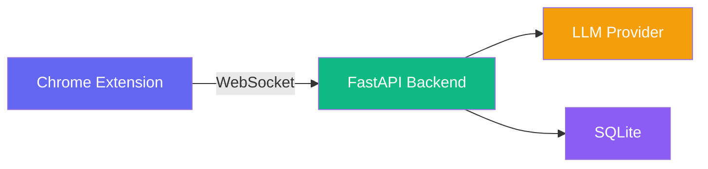

# Snag

AI-powered job application copilot. Bring your own API key — supports Ollama (local/free), OpenAI, Anthropic, Groq, or any OpenAI-compatible provider.

---

## Architecture



**Chrome Extension** — Detects form fields, injects sidebar, fills answers
**FastAPI Backend** — Classifies fields, generates answers via LLM, stores memory
**LLM Provider** — Ollama (local), OpenAI, Anthropic, Groq, or OpenAI-compatible
**SQLite** — Profile data, session history, saved answers with embeddings

---

## How It Works


1. **Page Loads** — Content script scans the DOM for form fields
2. **Extract Fields** — Labels, placeholders, types, and context are captured
3. **Classify** — Backend categorizes each field (name, email, question, etc.)
4. **User Clicks Question** — Click any open-ended question in the sidebar
5. **Generate Answer** — LLM generates a tailored draft using your profile + past answers
6. **Review** — Accept, Edit (then accept), Regenerate, or Skip
7. **Fill & Learn** — Accepting fills the field and stores the final answer as memory, so a similar question on a future application — even for a different company — can be recognized and adapted

Only an answer you actually accept (or edit-then-accept) is ever stored as memory. Regenerating or skipping never touches memory, and re-accepting the same question updates its existing memory entry instead of creating a duplicate.

---

## Project Structure

```
Snag/
├── backend/
│   ├── app.py                  # FastAPI entry point
│   ├── config.py               # Pydantic settings
│   ├── answer_service.py       # Builds the prompt/context sent to the extension's LLM call
│   ├── orchestrator.py         # Strands multi-agent graph (legacy, not on the live path)
│   ├── llm_providers/
│   │   └── provider_router.py  # Ollama/OpenAI/Anthropic/Groq
│   ├── memory/
│   │   ├── sqlite_store.py     # SQLite DB wrapper
│   │   ├── memory_service.py   # Semantic search (numpy)
│   │   └── embeddings.py       # sentence-transformers
│   ├── api/
│   │   ├── ws.py               # WebSocket handler
│   │   ├── answer_routes.py    # POST /api/answer/generate
│   │   ├── profile_routes.py   # Profile CRUD
│   │   └── memory_routes.py    # Memory retrieval
│   ├── agents/                 # Strands agent graph (legacy, not on the live path)
│   ├── prompts/                # Question-type templates
│   ├── tests/                  # pytest suite for the learning loop
│   └── requirements.txt
│
├── extension/
│   ├── manifest.json           # Manifest V3
│   ├── settings/               # Options page (API config)
│   ├── src/
│   │   ├── background/         # Service worker (health ping + WS)
│   │   ├── content/            # Content script
│   │   └── shared/             # Config utility
│   └── icons/                  # 16/48/128px SVG
│
├── ui/
│   ├── src/
│   │   ├── components/
│   │   │   ├── Sidebar.tsx     # Main layout
│   │   │   ├── StatusBadge.tsx # Live/Reconnecting/Offline
│   │   │   ├── ProfileSettings.tsx
│   │   │   ├── FeedbackModal.tsx
│   │   │   ├── AnswerCards.tsx
│   │   │   └── ...
│   │   └── hooks/
│   │       ├── useWebSocket.ts
│   │       ├── useProfile.ts
│   │       └── useProvider.ts
│   └── vite.config.ts
│
├── logs/                       # Runtime logs (created automatically)
├── Dockerfile
├── docker-compose.yml
├── start.py                    # Build + preflight + launch script
├── setup_service.ps1           # Install SnagBackend as a Windows service (NSSM)
└── SPECS.md
```

---

## Getting Started

### Prerequisites

- Python 3.12+
- Node.js 20+
- Ollama (optional — only if using local models)

### Quick Start (Local)

```bash
# 1. Install Python dependencies
pip install -r backend/requirements.txt

# 2. Install UI dependencies
cd ui && npm install && cd ..

# 3. Install extension dependencies
cd extension && npm install && cd ..

# 4. Build and run everything
python start.py
```

This will:
1. Build the React UI (`ui/build/`)
2. Copy it into the extension (`extension/sidebar/`)
3. Compile extension TypeScript
4. Run preflight checks (port availability, Ollama reachability)
5. Start the backend on `http://127.0.0.1:8765`

> [!TIP]
> Backend logs are written to `logs/snag.log` (rotating, 5MB × 5 backups).
> Warnings and errors also print to the console. SQLite runs in WAL mode
> with a 5s busy timeout so concurrent readers don't hit "database is locked".

### Run as a Windows Service (optional)

For always-on use, install the backend as a Windows service with [NSSM](https://nssm.cc/):

```powershell
# From an elevated (Administrator) PowerShell
.\setup_service.ps1              # install + start SnagBackend
.\setup_service.ps1 -Uninstall   # remove the service
```

The script auto-installs NSSM via winget if it's missing (or pass `-ForceInstallNssm`).
The service runs `python -m backend.app`, auto-starts on boot, restarts on
failure (5s delay), and writes to `logs/service_stdout.log` / `logs/service_stderr.log`.

### Load Extension in Chrome

1. Open `chrome://extensions`
2. Enable "Developer mode"
3. Click "Load unpacked" → select the `extension/` folder
4. Click the Snag icon on any page to toggle the sidebar

### Configure Your LLM Provider

1. Right-click the Snag icon → "Options"
2. Select your provider:
   - **Ollama** (local, free) — requires Ollama running with a model pulled
   - **OpenAI** — requires API key from platform.openai.com
   - **Anthropic** — requires API key from console.anthropic.com
   - **Groq** — free tier, get key from console.groq.com
   - **OpenAI-Compatible** — works with LM Studio, Together AI, etc.

### Docker

```bash
docker compose up --build
```

Backend runs on `http://localhost:8765`. Load the extension separately.

---

## API Endpoints

| Method | Endpoint | Description |
|---|---|---|
| `GET` | `/health` | Health check |
| `GET` | `/api/profile` | Get profile fields |
| `PUT` | `/api/profile/{key}` | Update a profile field |
| `POST` | `/api/answer/generate` | Generate answer (accepts `X-Provider`, `X-API-Key` headers) |
| `WS` | `/ws/{session_id}` | Real-time communication |

### Answer Generation Headers

When calling `/api/answer/generate`, pass provider config in headers:

```
X-Provider: openai
X-API-Key: sk-...
X-Model: gpt-4o-mini
X-Base-URL: https://api.openai.com/v1
```

For Ollama (default), no headers needed.

---

## Profile Fields

| Field | Required | Field | Required |
|---|---|---|---|
| First Name | Yes | City | No |
| Last Name | Yes | State | No |
| Email | Yes | Zip Code | No |
| Phone | No | Country | No |
| Gender | No | Work Authorization | No |
| Date of Birth | No | Visa Status | No |
| LinkedIn | No | Willing to Relocate | No |
| GitHub | No | Education | No |
| Portfolio | No | Experience | No |
| Skills | No | | |

---

## LLM Providers

| Provider | Default Model | Free Tier |
|---|---|---|
| Ollama | qwen3:8b | Yes (local) |
| OpenAI | gpt-4o-mini | No |
| Anthropic | claude-3-5-haiku | No |
| Groq | llama-3.1-70b-versatile | Yes |
| OpenAI-Compatible | configurable | Varies |

---

## Reliability

Built to run unattended as a persistent local tool:

- **SQLite WAL mode** — concurrent readers + one writer with a 5s busy timeout (no "database is locked")
- **Structured LLM errors** — retries with exponential backoff (1s, 2s) on timeouts/connect/5xx, then returns `{"error": true, "code": "LLM_TIMEOUT" | "LLM_UNREACHABLE" | "LLM_HTTP_ERROR" | "LLM_ERROR", "message": "..."}`; all provider calls time out at 60s
- **Startup preflight** — `start.py` verifies the port is free and warns (non-fatal) if Ollama is unreachable before launching
- **WebSocket reconnect** — the sidebar backs off exponentially (1s → 30s cap) and shows `Live` / `Reconnecting` / `Offline`
- **Extension health ping** — the service worker pings `/health` every 30s and broadcasts `backend:status` to the sidebar
- **Windows service** — `setup_service.ps1` registers the backend under NSSM with auto-start and restart-on-failure

---

## Memory & Retrieval

Approved answers are matched by semantic similarity (sentence-transformers embeddings,
cosine similarity) rather than exact text match, so paraphrased questions ("why do you
want to join this company" vs. "why are you interested in working here") retrieve the
same memory. Retrieval is **not** restricted to the current company/role — a same
company/role match ranks slightly higher, but a strong semantic match from a different
company still surfaces, and the answer-generation prompt explicitly instructs the model
to adapt (not copy) an answer written for a different company/role. Re-accepting the
same question for the same company/role updates that memory in place instead of
creating a duplicate row.

## Testing

```bash
# Backend test suite (profile CRUD, classification, semantic retrieval,
# cross-company adaptation, dedup, prompt construction, error handling)
python -m pip install -r backend/requirements.txt
python -m pytest -q
```

Tests run against an isolated temp SQLite file and a fast deterministic stand-in for
the embedding model — no model download or GPU needed to run them.

## Development

```bash
# TypeScript check (UI)
cd ui && npx tsc --noEmit

# TypeScript check (Extension)
cd extension && npx tsc --noEmit

# Backend import check
python -c "from backend.app import app; print('OK')"

# Backend tests
python -m pytest -q

# Build UI only
cd ui && npm run build

# Build extension only
cd extension && npm run build
```

---

## Known Limitations

- Form filling handles `<input>`/`<textarea>`/contenteditable, `<select>` dropdowns
  (matched by option value or visible text), and individual checkbox/radio inputs
  (matched against yes/no-style values or the option's own label). A **radio/checkbox
  group** (e.g. a multi-choice question rendered as several radio inputs) is still
  extracted as separate individual fields rather than one grouped question — Snag can
  fill a specific option once it knows which one, but doesn't yet reason about
  "which of these N options answers this question" as a single decision.
- Job context passed to answer generation includes a best-effort job description
  scrape (common ATS containers, falling back to the page's meta description),
  truncated to a few thousand characters. Sites with unusual layouts may still yield
  no description — generation degrades gracefully to title/company only.
- No automated tests for the extension/content-script layer (JS/TS) yet; the pytest
  suite covers the backend learning loop end-to-end.
- `backend/orchestrator.py` and `backend/agents/` are a pre-refactor Strands
  multi-agent design, superseded by the direct WebSocket handlers in `backend/api/ws.py`
  and `backend/answer_service.py`. Left in place but unused; candidate for removal.

---

## License

MIT
