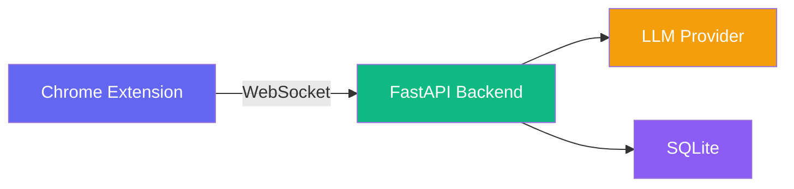

# Snag

AI-powered job application copilot. Bring your own API key — supports Ollama (local/free), OpenAI, Anthropic, Groq, or any OpenAI-compatible provider.

---

## Architecture



**Chrome Extension** — Detects form fields, injects sidebar, fills answers
**FastAPI Backend** — Classifies fields, generates answers via LLM, stores memory
**LLM Provider** — Ollama (local), OpenAI, Anthropic, Groq, or OpenAI-compatible
**SQLite** — Profile data, session history, saved answers with embeddings

---

## How It Works


1. **Page Loads** — Content script scans the DOM for form fields
2. **Extract Fields** — Labels, placeholders, types, and context are captured
3. **Classify** — Backend categorizes each field (name, email, question, etc.)
4. **User Clicks Question** — Click any open-ended question in the sidebar
5. **Generate Answer** — LLM generates a tailored draft using your profile + past answers
6. **Approve & Fill** — Click "Approve" to auto-fill the field

---

## Project Structure

```
Snag/
├── backend/
│   ├── app.py                  # FastAPI entry point
│   ├── config.py               # Pydantic settings
│   ├── answer_service.py       # LLM answer generation
│   ├── orchestrator.py         # Strands multi-agent graph
│   ├── llm_providers/
│   │   └── provider_router.py  # Ollama/OpenAI/Anthropic/Groq
│   ├── memory/
│   │   ├── sqlite_store.py     # SQLite DB wrapper
│   │   ├── memory_service.py   # Semantic search (numpy)
│   │   └── embeddings.py       # sentence-transformers
│   ├── api/
│   │   ├── ws.py               # WebSocket handler
│   │   ├── answer_routes.py    # POST /api/answer/generate
│   │   ├── profile_routes.py   # Profile CRUD
│   │   └── memory_routes.py    # Memory retrieval
│   ├── agents/                 # Strands agent definitions
│   ├── prompts/                # Question-type templates
│   └── requirements.txt
│
├── extension/
│   ├── manifest.json           # Manifest V3
│   ├── settings/               # Options page (API config)
│   ├── src/
│   │   ├── background/         # Service worker
│   │   ├── content/            # Content script
│   │   └── shared/             # Config utility
│   └── icons/                  # 16/48/128px SVG
│
├── ui/
│   ├── src/
│   │   ├── components/
│   │   │   ├── Sidebar.tsx     # Main layout
│   │   │   ├── ProfileSettings.tsx
│   │   │   ├── FeedbackModal.tsx
│   │   │   ├── AnswerCards.tsx
│   │   │   └── ...
│   │   └── hooks/
│   │       ├── useWebSocket.ts
│   │       ├── useProfile.ts
│   │       └── useProvider.ts
│   └── vite.config.ts
│
├── Dockerfile
├── docker-compose.yml
├── start.py                    # Build + launch script
└── SPECS.md
```

---

## Getting Started

### Prerequisites

- Python 3.12+
- Node.js 20+
- Ollama (optional — only if using local models)

### Quick Start (Local)

```bash
# 1. Install Python dependencies
pip install -r backend/requirements.txt

# 2. Install UI dependencies
cd ui && npm install && cd ..

# 3. Install extension dependencies
cd extension && npm install && cd ..

# 4. Build and run everything
python start.py
```

This will:
1. Build the React UI (`ui/build/`)
2. Copy it into the extension (`extension/sidebar/`)
3. Compile extension TypeScript
4. Start the backend on `http://127.0.0.1:8765`

### Load Extension in Chrome

1. Open `chrome://extensions`
2. Enable "Developer mode"
3. Click "Load unpacked" → select the `extension/` folder
4. Click the Snag icon on any page to toggle the sidebar

### Configure Your LLM Provider

1. Right-click the Snag icon → "Options"
2. Select your provider:
   - **Ollama** (local, free) — requires Ollama running with a model pulled
   - **OpenAI** — requires API key from platform.openai.com
   - **Anthropic** — requires API key from console.anthropic.com
   - **Groq** — free tier, get key from console.groq.com
   - **OpenAI-Compatible** — works with LM Studio, Together AI, etc.

### Docker

```bash
docker compose up --build
```

Backend runs on `http://localhost:8765`. Load the extension separately.

---

## API Endpoints

| Method | Endpoint | Description |
|---|---|---|
| `GET` | `/health` | Health check |
| `GET` | `/api/profile` | Get profile fields |
| `PUT` | `/api/profile/{key}` | Update a profile field |
| `POST` | `/api/answer/generate` | Generate answer (accepts `X-Provider`, `X-API-Key` headers) |
| `WS` | `/ws/{session_id}` | Real-time communication |

### Answer Generation Headers

When calling `/api/answer/generate`, pass provider config in headers:

```
X-Provider: openai
X-API-Key: sk-...
X-Model: gpt-4o-mini
X-Base-URL: https://api.openai.com/v1
```

For Ollama (default), no headers needed.

---

## Profile Fields

| Field | Required | Field | Required |
|---|---|---|---|
| First Name | Yes | City | No |
| Last Name | Yes | State | No |
| Email | Yes | Zip Code | No |
| Phone | No | Country | No |
| Gender | No | Work Authorization | No |
| Date of Birth | No | Visa Status | No |
| LinkedIn | No | Willing to Relocate | No |
| GitHub | No | Education | No |
| Portfolio | No | Experience | No |
| Skills | No | | |

---

## LLM Providers

| Provider | Default Model | Free Tier |
|---|---|---|
| Ollama | qwen3:8b | Yes (local) |
| OpenAI | gpt-4o-mini | No |
| Anthropic | claude-3-5-haiku | No |
| Groq | llama-3.1-70b-versatile | Yes |
| OpenAI-Compatible | configurable | Varies |

---

## Development

```bash
# TypeScript check (UI)
cd ui && npx tsc --noEmit

# TypeScript check (Extension)
cd extension && npx tsc --noEmit

# Backend import check
python -c "from backend.app import app; print('OK')"

# Build UI only
cd ui && npm run build

# Build extension only
cd extension && npm run build
```

---

## License

MIT
